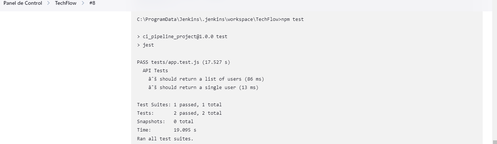

# Informe de ejecución del pipeline Proyecto TechFlow

## Resumen

Este informe describe los pasos tomados para configurar y ejecutar la canalización CI/CD
para el proyecto de API de tareas.

## Pasos

1. **Creación del Repositorio**

    - Se inicializa el repositorio en GitHub. y se suben los archivos del proyecto.
    - https://github.com/FelipeCarillancaDev/TechFlow

2. **Configuración de Jenkins**

    - Se configura Jenkins para automatizar el proceso de compilación, prueba e implementación.

   
## Errores encontrador
- Se encontro un error al ejecutar el pipeline en Jenkins. Debi a la configuración del nombre del archivo de jenkinsfile y no se encontraba.


## Resultados
   
- Resultados de la ejecución del pipeline

- Evidencia de la ejecución de las pruebas exitosas de Test

- Evidencia de la ejecución de las pruebas fallidas de Test. Se modificó parte del codigo de lo que espera la prueba
```
  it('should return a single user', async () => {
    const res = await request(app).get('/users/1');
    expect(res.statusCode).toEqual(200);
    expect(res.body.name).toEqual('felipe'); // <- Modificado Alice por felipe
  });
```


---
- Se adjunta Logs de ejecución de Jenkins
```
Lanzada por el usuario felipe
Obtained Jenkinsfile from git https://github.com/FelipeCarillancaDev/TechFlow.git
[Pipeline] Start of Pipeline
[Pipeline] node
Running on Jenkins  in C:\ProgramData\Jenkins\.jenkins\workspace\TechFlow
[Pipeline] {
[Pipeline] stage
[Pipeline] { (Declarative: Checkout SCM)
[Pipeline] checkout
Selected Git installation does not exist. Using Default
The recommended git tool is: NONE
No credentials specified
Cloning the remote Git repository
Cloning repository https://github.com/FelipeCarillancaDev/TechFlow.git
 > git.exe init C:\ProgramData\Jenkins\.jenkins\workspace\TechFlow # timeout=10
Fetching upstream changes from https://github.com/FelipeCarillancaDev/TechFlow.git
 > git.exe --version # timeout=10
 > git --version # 'git version 2.45.1.windows.1'
 > git.exe fetch --tags --force --progress -- https://github.com/FelipeCarillancaDev/TechFlow.git +refs/heads/*:refs/remotes/origin/* # timeout=10
 > git.exe config remote.origin.url https://github.com/FelipeCarillancaDev/TechFlow.git # timeout=10
 > git.exe config --add remote.origin.fetch +refs/heads/*:refs/remotes/origin/* # timeout=10
Avoid second fetch
 > git.exe rev-parse "refs/remotes/origin/main^{commit}" # timeout=10
Checking out Revision c9af299e35d1cb00bd6e7e9e43c1bc9547439c99 (refs/remotes/origin/main)
 > git.exe config core.sparsecheckout # timeout=10
 > git.exe checkout -f c9af299e35d1cb00bd6e7e9e43c1bc9547439c99 # timeout=10
Commit message: "arregla JenkinsFile"
First time build. Skipping changelog.
[Pipeline] }
[Pipeline] // stage
[Pipeline] withEnv
[Pipeline] {
[Pipeline] stage
[Pipeline] { (Clonar Repositorio)
[Pipeline] git
Selected Git installation does not exist. Using Default
The recommended git tool is: NONE
No credentials specified
 > git.exe rev-parse --resolve-git-dir C:\ProgramData\Jenkins\.jenkins\workspace\TechFlow\.git # timeout=10
Fetching changes from the remote Git repository
 > git.exe config remote.origin.url https://github.com/FelipeCarillancaDev/TechFlow.git # timeout=10
Fetching upstream changes from https://github.com/FelipeCarillancaDev/TechFlow.git
 > git.exe --version # timeout=10
 > git --version # 'git version 2.45.1.windows.1'
 > git.exe fetch --tags --force --progress -- https://github.com/FelipeCarillancaDev/TechFlow.git +refs/heads/*:refs/remotes/origin/* # timeout=10
 > git.exe rev-parse "refs/remotes/origin/main^{commit}" # timeout=10
Checking out Revision c9af299e35d1cb00bd6e7e9e43c1bc9547439c99 (refs/remotes/origin/main)
 > git.exe config core.sparsecheckout # timeout=10
 > git.exe checkout -f c9af299e35d1cb00bd6e7e9e43c1bc9547439c99 # timeout=10
 > git.exe branch -a -v --no-abbrev # timeout=10
 > git.exe checkout -b main c9af299e35d1cb00bd6e7e9e43c1bc9547439c99 # timeout=10
Commit message: "arregla JenkinsFile"
[Pipeline] }
[Pipeline] // stage
[Pipeline] stage
[Pipeline] { (Instalar Dependencias)
[Pipeline] bat

C:\ProgramData\Jenkins\.jenkins\workspace\TechFlow>npm install 
npm WARN deprecated inflight@1.0.6: This module is not supported, and leaks memory. Do not use it. Check out lru-cache if you want a good and tested way to coalesce async requests by a key value, which is much more comprehensive and powerful.
npm WARN deprecated glob@7.2.3: Glob versions prior to v9 are no longer supported
npm WARN deprecated superagent@8.1.2: Please upgrade to v9.0.0+ as we have fixed a public vulnerability with formidable dependency. Note that v9.0.0+ requires Node.js v14.18.0+. See https://github.com/ladjs/superagent/pull/1800 for insight. This project is supported and maintained by the team at Forward Email @ https://forwardemail.net

added 355 packages, and audited 356 packages in 24s

48 packages are looking for funding
  run `npm fund` for details

found 0 vulnerabilities
[Pipeline] }
[Pipeline] // stage
[Pipeline] stage
[Pipeline] { (Ejecutar Pruebas)
[Pipeline] bat

C:\ProgramData\Jenkins\.jenkins\workspace\TechFlow>npm test 

> ci_pipeline_project@1.0.0 test
> jest

PASS tests/app.test.js (17.527 s)
  API Tests
    √ should return a list of users (86 ms)
    √ should return a single user (13 ms)

Test Suites: 1 passed, 1 total
Tests:       2 passed, 2 total
Snapshots:   0 total
Time:        19.095 s
Ran all test suites.
[Pipeline] }
[Pipeline] // stage
[Pipeline] stage
[Pipeline] { (Levantar API)
[Pipeline] echo
Levantando API...
[Pipeline] bat

C:\ProgramData\Jenkins\.jenkins\workspace\TechFlow>start /B npm start 
[Pipeline] sleep
Sleeping for 5 Seg
[Pipeline] }
[Pipeline] // stage
[Pipeline] }
[Pipeline] // withEnv
[Pipeline] }
[Pipeline] // node
[Pipeline] End of Pipeline
Finished: SUCCESS
```